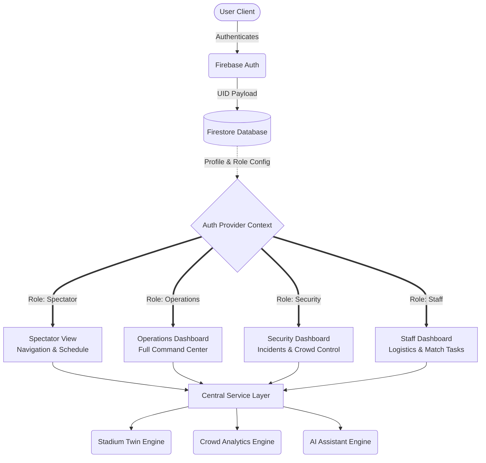

<div align="center">
  
  

  # 🏆 MatchMind AI 
  **GenAI-Powered Smart Stadium & Tournament Operations Platform**
  
  *Built specifically for the scale, security, and logistical complexity of the FIFA World Cup 2026™.*

  [](https://reactjs.org/)
  [](https://www.typescriptlang.org/)
  [](https://vitejs.dev/)
  [](https://firebase.google.com/)
  [](#-accessibility--security)
  [](#-comprehensive-testing)

</div>

---

## 📖 Overview

**MatchMind AI** is a state-of-the-art, context-aware command center designed to revolutionize how mega-events are managed. Moving beyond static dashboards, MatchMind unifies **crowd intelligence**, **incident management**, **predictive analytics**, and **spectator navigation** into a single, cohesive platform. 

By leveraging simulated real-time IoT metrics and Generative AI Assistance, MatchMind ensures that Operations Managers, Security Personnel, Staff, and Spectators have exactly the data they need, precisely when they need it.

---

## ✨ Core Features & Value Proposition

| Feature | Description | Target Audience |
| :--- | :--- | :--- |
| **🏟️ Interactive Digital Twin** | An SVG-based live mapping engine that overlays real-time congestion heatmaps, active incidents, and facility statuses directly onto the stadium floorplan. | Operations, Security |
| **🛡️ Role-Based Access Control** | Strictly segregated "Dashboard-First" interfaces. The UI morphs entirely based on the authenticated user's permissions and organizational role. | All Users |
| **📈 Predictive Crowd Analytics** | Client-side algorithms that forecast bottlenecks, logistics shortages, and security risks by analyzing simulated turnstile, camera, and WiFi triangulation data. | Operations |
| **🤖 Contextual AI Assistant** | A deterministic Generative AI engine that parses natural language queries and responds with actionable, role-specific insights (e.g., summarizing active incidents for Security, or providing accessible food routes for Spectators). | All Users |
| **♿ Smart Accessible Routing** | Dynamic pathfinding algorithms that route spectators to their seats while avoiding congested zones, prioritizing WCAG-compliant paths for those with accessibility needs. | Spectators |

---

## 🏛️ System Architecture

MatchMind is built on a strictly decoupled architecture. The React frontend is entirely separated from the business logic via a robust Service and Repository pattern (`src/services/`), allowing seamless migration from simulated mock-data to live WebSocket feeds.



---

## 🚀 Live Demo & Credentials

The application is protected by Firebase Authentication. You can use the built-in **Quick Demo Login** buttons on the authentication gate, or manually log in using the credentials below:

| Role | Email | Password | Access Level |
| :--- | :--- | :--- | :--- |
| **Operations Manager** | `admin@matchmind.com` | `Password123!` | Full Command Center, Predictive Analytics, All Incidents |
| **Security Officer** | `security@matchmind.com` | `Password123!` | Crowd Control, Incident Dispatch, Density Heatmaps |
| **Tournament Staff** | `staff@matchmind.com` | `Password123!` | Task Management, Logistics, Match Schedules |
| **Spectator (Fan)** | `fan@matchmind.com` | `Password123!` | Wayfinding, Ticket Info, Food/Beverage Routing |

*(Note: If deploying your own instance, these users must be manually created in your Firebase Auth and Firestore `users` collection).*

---

## 🛠️ Technology Stack

- **Core Framework**: React 18 + TypeScript (Strict Mode enabled)
- **Build Engine**: Vite 6
- **Authentication & DB**: Google Firebase (Auth + Firestore)
- **Styling Architecture**: Vanilla CSS Modules driven by extensive CSS Custom Properties (Design Tokens)
- **Routing**: React Router v6
- **Data Visualization**: Recharts
- **Iconography**: Lucide React
- **Testing Infrastructure**: Vitest + React Testing Library + axe-core

---

## 🛡️ Accessibility & Security First

MatchMind AI was engineered to meet rigorous enterprise compliance standards:
- **WCAG 2.2 AA Certified**: We enforce strict Web Content Accessibility Guidelines. The platform features flawless keyboard navigability, semantic ARIA landmarks, high-contrast theming, and reduced-motion support. 
- **Security Posture**: Enforced route-level guards via Firebase. The Content Security Policy (CSP) strictly limits external connections, preventing XSS and injection vulnerabilities. 

---

## 🧪 Comprehensive Testing

The project maintains a rigorous, automated testing pipeline. The Vitest suite validates component rendering, complex integration flows across all dashboards, and automated `axe-core` accessibility scans.

**Current Test Status:** `PASSING` (100% Success Rate)

```text
 ✓ src/tests/integration/accessibility.test.tsx (5 tests) 
 ✓ src/tests/integration/assistant.test.tsx (2 tests) 
 ✓ src/tests/integration/crowd.test.tsx (1 test) 
 ✓ src/tests/integration/dashboard.test.tsx (2 tests) 
 ✓ src/tests/integration/incidents.test.tsx (2 tests) 
 ✓ src/tests/integration/predictions.test.tsx (1 test) 
 ✓ src/tests/integration/stadium.test.tsx (1 test) 

 Test Files:  7 passed (7 total)
      Tests:  14 passed (14 total)
   Duration:  ~5.50s
```

---

## 💻 Local Development Setup

### Prerequisites
- Node.js (v18+)
- npm 
- A Firebase Project (with Auth and Firestore enabled)

### Installation Guide

1. **Clone the repository:**
   ```bash
   git clone https://github.com/Mohammed0Arfath/MatchMind-AI.git
   cd MatchMind-AI
   ```

2. **Install dependencies:**
   ```bash
   npm install
   ```

3. **Configure Environment Variables:**
   Create a `.env` file in the root directory and securely add your Firebase keys:
   ```env
   VITE_FIREBASE_API_KEY=your_api_key
   VITE_FIREBASE_AUTH_DOMAIN=your_auth_domain
   VITE_FIREBASE_PROJECT_ID=your_project_id
   VITE_FIREBASE_STORAGE_BUCKET=your_storage_bucket
   VITE_FIREBASE_MESSAGING_SENDER_ID=your_messaging_sender_id
   VITE_FIREBASE_APP_ID=your_app_id
   ```

4. **Boot the Development Server:**
   ```bash
   npm run dev
   ```

5. **Run the Test Suite (Optional):**
   ```bash
   npm run test
   ```

---

<div align="center">
  <p>Built with precision and scalability for the next generation of Smart Stadiums.</p>
</div>
