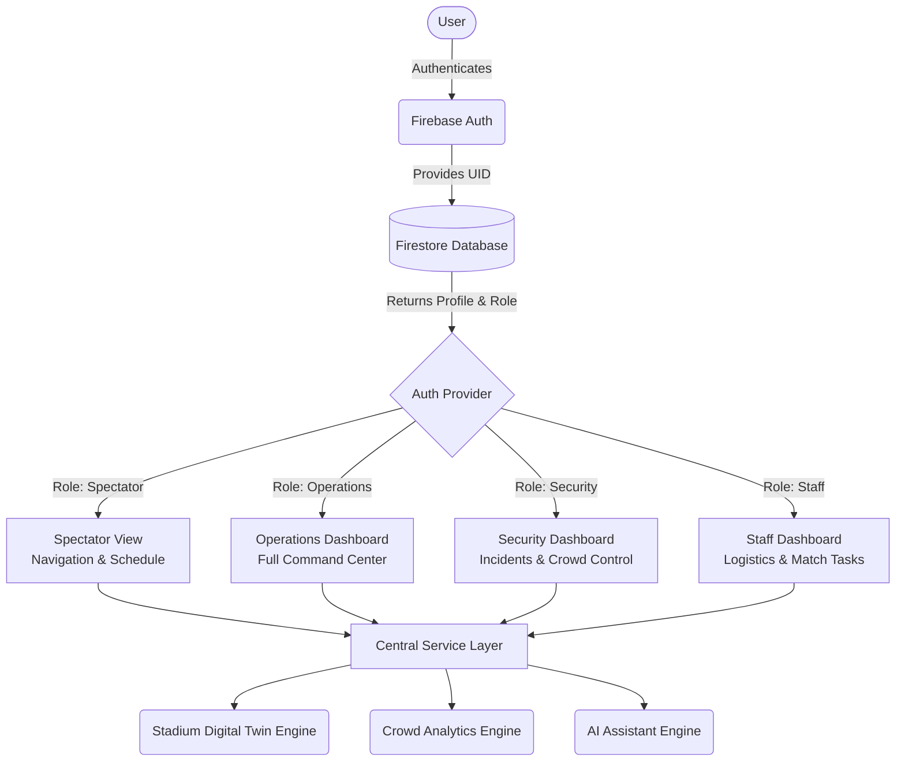

# MatchMind AI

> GenAI-powered Smart Stadium & Tournament Operations Platform for FIFA World Cup 2026.

## 🎯 Chosen Vertical
**Sports Technology & Event Operations (Smart Stadiums)**

MatchMind AI is built specifically for the logistical and security challenges of managing mega-events like the FIFA World Cup 2026. It serves as a centralized, context-aware command center that unifies crowd intelligence, incident management, predictive analytics, and spectator navigation into a single, cohesive platform.

## 🧠 Approach and Logic
The architectural approach prioritizes modularity, high performance, and enterprise-grade security:
- **Decoupled Architecture**: The frontend UI is strictly separated from the business logic through a robust Service and Repository pattern (`src/services/`). This ensures the app can easily transition from mocked offline data to a live backend API without touching UI components.
- **Role-Based Access Control (RBAC)**: We adopted a "Dashboard-First" design philosophy tailored to specific user personas (Operations, Security, Spectator, Staff). The UI completely adapts based on the user's role.
- **Real-Time Data Simulation**: To demonstrate the platform's capabilities, we implemented a sophisticated simulation layer that mimics real-time WebSocket feeds for crowd density, queue times, and live match statistics.
- **Accessibility & Security First**: The platform strictly adheres to WCAG 2.2 AA standards (fully keyboard navigable, high contrast themes, ARIA landmarks) and enforces route-level authentication using Firebase Auth.

## 🏛️ System Architecture



## ⚙️ How the Solution Works
MatchMind AI provides distinct experiences based on who is logged in:
1. **Authentication Gate**: Users authenticate via Firebase (Email/Password or Google Sign-In). A Firestore database assigns them a specific role.
2. **Operations & Security**: Staff access the "Digital Twin" of the stadium—an interactive SVG map overlaying live data (congestion heatmaps, facility statuses, and active incidents). They can view predictive analytics to pre-emptively deploy resources to expected bottlenecks.
3. **Spectators**: Fans receive a simplified mobile-friendly view focused on smart navigation. The system routes them to their seats or facilities while actively avoiding congested zones.
4. **AI Assistant Engine**: An integrated generative AI assistant contextually linked to the user's role. For Operations, it summarizes active incidents; for Spectators, it provides navigation help and food recommendations.

## 📝 Assumptions Made
- **Infrastructure**: Assumes the stadium is equipped with IoT sensors (turnstiles, cameras, WiFi triangulation) capable of feeding real-time density metrics to our service layer.
- **Authentication**: Assumes user roles are provisioned externally by tournament administration and stored in a NoSQL database (Firestore `users` collection) linked by Firebase UIDs.
- **Predictive Models**: Assumes historical attendance data and current match stakes are available to fuel the client-side predictive analytics engine.
- **Environment**: The platform is built as a Single Page Application (SPA) assuming modern browser capabilities (React 18, CSS Variables, SVG manipulation).

---

## 🛠️ Technology Stack
- **Framework**: React 18 + TypeScript (strict mode)
- **Build Tool**: Vite 6
- **Authentication**: Firebase Auth & Firestore
- **Styling**: Vanilla CSS Modules with CSS Custom Properties (Theme/Tokens)
- **Routing**: React Router v6
- **Data Visualization**: Recharts
- **Icons**: Lucide React
- **Testing**: Vitest + React Testing Library + axe-core

## 🚀 Getting Started

### Prerequisites
- Node.js (v18+)
- npm
- A Firebase Project (for Authentication)

### Installation
1. Clone the repository and install dependencies:
   ```bash
   git clone https://github.com/Mohammed0Arfath/MatchMind-AI.git
   cd MatchMind-AI
   npm install
   ```

2. Create a `.env` file in the root directory and add your Firebase configuration:
   ```env
   VITE_FIREBASE_API_KEY=your_api_key
   VITE_FIREBASE_AUTH_DOMAIN=your_auth_domain
   VITE_FIREBASE_PROJECT_ID=your_project_id
   VITE_FIREBASE_STORAGE_BUCKET=your_storage_bucket
   VITE_FIREBASE_MESSAGING_SENDER_ID=your_messaging_sender_id
   VITE_FIREBASE_APP_ID=your_app_id
   ```

3. Start the development server:
   ```bash
   npm run dev
   ```

## 🧪 Testing Suite
The project includes a robust testing suite powered by **Vitest** and **React Testing Library**. It covers component validation, complex dashboard integration flows, and automated accessibility scans ensuring zero a11y violations (WCAG 2.2 AA) across the platform.

### Latest Test Results
All 14 tests across 7 integration suites are passing flawlessly, validating both functionality and strict accessibility compliance.

```text
 ✓ src/tests/integration/accessibility.test.tsx (5) 
 ✓ src/tests/integration/assistant.test.tsx (2) 
 ✓ src/tests/integration/crowd.test.tsx (1) 
 ✓ src/tests/integration/dashboard.test.tsx (2) 
 ✓ src/tests/integration/incidents.test.tsx (2) 
 ✓ src/tests/integration/predictions.test.tsx (1) 
 ✓ src/tests/integration/stadium.test.tsx (1) 

 Test Files  7 passed (7)
      Tests  14 passed (14)
```

To run the tests locally:
```bash
npm run test
```

## 📜 License

This project is intended as a demonstration of a highly polished, dashboard-driven enterprise web application.
